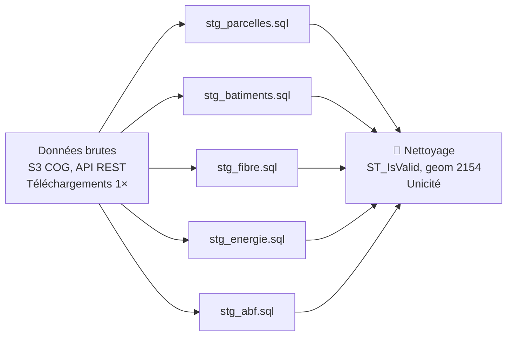
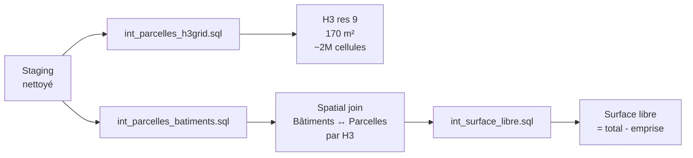
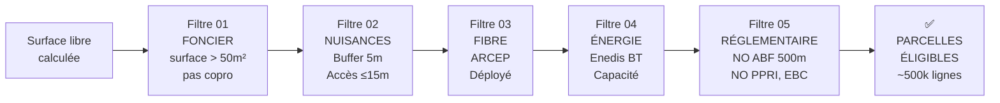

# Structure Métier — Mini Data Center Selector

## 1. ARBORESCENCE DU PROJET

```
mini-data-center-selector/
│
├── README.md                              # Documentation générale
├── DATA_SOURCES.md                        # Sources données, licences, coûts
├── METHODOLOGY.md                         # Rationale des seuils métier
├── docker/
│   ├── Dockerfile
│   ├── requirements.txt
│   └── entrypoint.sh
│
├── dbt/
│   ├── dbt_project.yml                    # Config dbt
│   ├── profiles.yml                       # Connexion DuckDB
│   │
│   ├── models/
│   │   ├── staging/                       # 🔧 Nettoyage brut
│   │   │   ├── stg_parcelles.sql          # Cadastre : géométries valides, doublons
│   │   │   ├── stg_batiments.sql          # BD TOPO : usage résidentiel, geom valides
│   │   │   ├── stg_fibre.sql              # ARCEP : IPE, statut déploiement
│   │   │   ├── stg_energie.sql            # Enedis : postes sources, capacités BT
│   │   │   ├── stg_abf.sql                # ABF : monuments historiques + 500m buffer
│   │   │   ├── stg_ppri.sql               # PPRI : zones inondables
│   │   │   └── stg_ebc.sql                # EBC : espaces boisés classés
│   │   │
│   │   ├── intermediate/                  # 🔗 Jointures spatiales
│   │   │   ├── int_parcelles_h3grid.sql   # Indexation H3 résolution 9
│   │   │   ├── int_parcelles_batiments.sql # Jointure parcelles ↔ bâtiments
│   │   │   └── int_surface_libre.sql      # Calcul : Surface libre > 50 m²
│   │   │
│   │   └── marts/                         # 📊 Livrables métier
│   │       ├── fct_parcelles_base.sql     # Table centrale (étape 0)
│   │       ├── fct_filtre_01_foncier.sql  # Après étape 1 (habitat indiv)
│   │       ├── fct_filtre_02_nuisances.sql # Après étape 2 (buffers)
│   │       ├── fct_filtre_03_fibre.sql    # Après étape 3 (ARCEP)
│   │       ├── fct_filtre_04_energie.sql  # Après étape 4 (Enedis)
│   │       ├── fct_filtre_05_reglement.sql # Après étape 5 (ABF/PPRI/EBC)
│   │       ├── fct_scoring.sql            # Scoring 0–100
│   │       ├── fct_parcelles_eligibles.sql # Final : parcelles éligibles
│   │       └── fct_heatmap_quartiers.sql  # Agrégation H3 pour carto
│   │
│   └── tests/
│       ├── accepted_values/
│       │   └── test_dept_codes.sql        # Codes département valides
│       ├── generic/
│       │   ├── test_not_null.sql
│       │   ├── test_unique.sql
│       │   ├── test_valid_geometries.sql  # ST_IsValid
│       │   └── test_coverage_spatial.sql  # Couverture complète par région
│       └── specific/
│           ├── test_filtre_02_buffer.sql  # Buffers 5m appliqués
│           ├── test_filtre_03_arcep.sql   # Statut ARCEP cohérent
│           ├── test_scoring_range.sql     # Score ∈ [0, 100]
│           └── test_no_spatial_leakage.sql # Validation BlockCV
│
├── data/
│   ├── raw/                               # 📥 Données brutes (téléchargement 1×)
│   │   ├── arcep_locaux.csv               # ARCEP IPE
│   │   ├── enedis_postes_sources.csv      # Enedis capacités
│   │   ├── abf_monuments.geojson          # ABF : monuments historiques
│   │   ├── ppri_zones_inondables.geojson  # PPRI
│   │   └── ebc_espaces_boises.geojson     # EBC
│   │
│   ├── processed/                         # 🔄 Outputs intermédiaires (GeoParquet)
│   │   ├── parcelles_h3grid.parquet       # Indexation H3
│   │   ├── surface_libre.parquet          # Surface libre par parcelle
│   │   ├── buffers_nuisances.parquet      # Buffers appliqués
│   │   └── filtre_*.parquet               # Outputs chaque étape
│   │
│   └── outputs/                           # 📤 Livrables finaux
│       ├── parcelles_eligibles.parquet    # Main : 500k lignes
│       ├── scoring.parquet                # Scoring détaillé
│       ├── heatmap_quartiers.geojson      # Carto : densité parcelles
│       ├── parcelles_premium_top100.csv   # Top 100 premium (export excel)
│       └── performance.json               # Métriques d'exécution
│
├── notebooks/                             # 📓 Explorations / validations
│   ├── 01_data_profiling.ipynb            # EDA sur sources
│   ├── 02_validation_filtres.ipynb        # Vérif chaque filtre
│   └── 03_scoring_analysis.ipynb          # Distribution scores
│
├── scripts/
│   ├── install_dependencies.sh            # Setup dbt + extensions
│   ├── run_pipeline.sh                    # Lancer dbt run complet
│   ├── validate_pipeline.sh               # Lancer tests dbt
│   ├── export_results.py                  # Pandas export résultats
│   └── generate_pmtiles.py                # Générer PMTiles pour carto
│
├── .github/workflows/
│   └── nightly_run.yml                    # CI/CD : dbt run si données fraîches
│
├── .gitignore                             # Venv, checkpoints, gros fichiers
└── .env.example                           # Template variables d'env

```

---

## 2. MODÈLE DE DONNÉES

### 2.1 Table centrale : `fct_parcelles_base`

```sql
-- Avant filtrage : toutes parcelles + géométries
CREATE TABLE fct_parcelles_base AS
SELECT
  id_parcelle,                    -- PK : cadastre
  commune,
  dept,
  epsg_code,                      -- 2154 (Lambert 93)
  geom_parcelle,                  -- Géométrie complète
  surface_parcelle_m2,            -- En m²
  
  -- Indices H3 (jointures rapides)
  h3_res9_id,                     -- Clé de jointure
  
  -- Bâtiments associés
  count_batiments_residentiel,    -- Nombre bâtiments résid.
  emprise_batiments_m2,           -- Somme emprises
  surface_libre_m2,               -- Libre = total - emprise
  
  -- Métadonnées
  created_at,
  updated_at
FROM ...
```

### 2.2 Table de filtrage progressif : `fct_filtre_*`

Chaque étape crée une table de sortie avec flag `pass_filtre_X`.

```sql
-- Exemple : après étape 1 (foncier)
CREATE TABLE fct_filtre_01_foncier AS
SELECT
  id_parcelle,
  commune,
  
  -- Résultat filtre 1
  pass_filtre_01_foncier,         -- TRUE si surface_libre > 50 m²
  raison_rejet_01,                -- Ex: "surface_libre < 50m2"
  score_foncier,                  -- Points foncier (0–20)
  
  FROM fct_parcelles_base
  WHERE surface_libre_m2 > 50
```

### 2.3 Table de scoring : `fct_scoring`

```sql
CREATE TABLE fct_scoring AS
SELECT
  id_parcelle,
  
  -- Points par critère (chacun 0–20)
  score_foncier,                  -- Surface libre
  score_nuisances,                -- Buffers appliqués
  score_fibre,                    -- Fibre déployée
  score_energie,                  -- Capacité réseau
  score_environnement,            -- Pas de contrainte réglementaire
  
  -- Bonus
  bonus_pv_proximite,             -- +5 si PV dans 500m
  bonus_borne_ve,                 -- +5 si bornes VE proches
  bonus_poste_proche,             -- +5 si poste source <500m
  
  -- Totaux
  score_total,                    -- SUM(scores) + SUM(bonus) → [0, 100]
  percentile_score,               -- Rank percentile (top 10%, etc.)
  
  -- Classement
  eligibilite,                    -- "Premium" (>80), "Bon" (60–80), "Moyen" (<60)
```

### 2.4 Table finale : `fct_parcelles_eligibles`

```sql
CREATE TABLE fct_parcelles_eligibles AS
SELECT
  id_parcelle,
  commune,
  dept,
  
  -- Géométrie
  geom_parcelle,
  
  -- Filtres appliqués (booléens)
  pass_01_foncier,
  pass_02_nuisances,
  pass_03_fibre,
  pass_04_energie,
  pass_05_reglement,
  pass_all_filtres,               -- TRUE si tous = TRUE
  
  -- Scoring
  score_total,
  eligibilite_classe,
  
  -- Attributs utiles pour commerciaux
  poste_source_distance_m,        # Distance au poste source (m)
  borne_ve_distance_m,            # Distance borne VE la + proche (m)
  fibre_statut,                   # "Déployé", "Raccordable"
  
  -- Contactabilité
  proprietaire_nom,               # (optionnel : si data dispo)
  proprietaire_mail,              # (optionnel)
  
  -- Traçabilité
  run_date,
  data_version
WHERE pass_all_filtres = TRUE
```

### 2.5 Table d'agrégation : `fct_heatmap_quartiers`

```sql
CREATE TABLE fct_heatmap_quartiers AS
SELECT
  h3_res8_id,                     -- Résolution plus grossière (500m)
  geom_h3_cell,                   # Géométrie cellule H3
  
  count_parcelles_eligibles,      # Nombre parcelles éligibles dans cellule
  count_parcelles_premium,        # Nombre "Premium" (score > 80)
  
  avg_score,                      # Score moyen dans cellule
  
  communes_incluses,              # Liste communes intersectant cellule
  dept,                           # Département dominant
  
  densité_commerciale             # Indice pour priorisation déploiement
```

---

## 3. WORKFLOWS & ÉTAPES

### Phase 1 : Data Ingestion (Staging)



### Phase 2 : Spatial Indexing & Joins



### Phase 3 : Progressive Filtering



### Phase 4 : Scoring & Ranking

```
ELIGIBLE parcelles
    ↓
Scoring model (dbt SQL)
    ├─ Foncier : 0–20 pts (surface libre)
    ├─ Nuisances : 0–20 pts (buffer OK)
    ├─ Fibre : 0–20 pts (déployé vs raccordable)
    ├─ Énergie : 0–20 pts (capacité réseau)
    ├─ Environnement : 0–20 pts (pas de contrainte)
    │
    ├─ Bonus : +5 pts PV proximité
    ├─ Bonus : +5 pts Borne VE
    ├─ Bonus : +5 pts Poste source <500m
    │
    ↓
Score total : [0, 100]
    ├─ "Premium" (80–100)
    ├─ "Bon" (60–79)
    └─ "Moyen" (40–59)
```

### Phase 5 : Aggregation & Export

```
Parcelles éligibles + scoring
    ↓
H3 res 8 aggregation (500m)
    ├─ Count éligibles / cellule
    ├─ Count premium / cellule
    ├─ Avg score / cellule
    ↓
Heatmap quartiers (GeoJSON)
    ↓
PMTiles (pour carto web) + Parquet (pour analyse)
```

---

## 4. TABLES DE JOINTURE CLÉS

### H3 Index (Spatial Joining)

```sql
-- Primary key pour jointures rapides
CREATE TABLE h3_index_parcelles AS
SELECT DISTINCT
  h3_res9_id,
  ST_Envelope(ST_Collect(geom)) as h3_bbox,  -- Bounding box
  COUNT(*) as count_parcelles
FROM fct_parcelles_base
GROUP BY h3_res9_id
INDEX: CREATE INDEX idx_h3_res9 ON fct_parcelles_base(h3_res9_id)
```

### Référence ARCEP Fibre

```sql
CREATE TABLE ref_arcep_locaux AS
SELECT
  id_locale,
  commune,
  geom_locale,
  statut_deploiement,             -- "Déployé", "Raccordable", "En cours", "Non prévu"
  distance_raccordement_m,
  operateur_principal
```

### Référence Enedis Capacités

```sql
CREATE TABLE ref_enedis_capacites AS
SELECT
  id_poste_source,
  commune,
  geom_poste,
  puissance_max_kva,
  puissance_disponible_kva,       -- Clé pour scoring
  tension_basse_lignes[]          -- Lignes associées
```

---

## 5. MÉTRIQUES & VALIDATION

### 5.1 Checkpoints de volume

| Étape | Table | Lignes attendues | %retention | Durée estimée |
|-------|-------|-----------------|-----------|---------------|
| 0. Base | `fct_parcelles_base` | 140M | 100% | 15 min |
| 1. Foncier | `fct_filtre_01_foncier` | 80M | 57% | 10 min |
| 2. Nuisances | `fct_filtre_02_nuisances` | 60M | 43% | 15 min |
| 3. Fibre | `fct_filtre_03_fibre` | 15M | 11% | 5 min |
| 4. Énergie | `fct_filtre_04_energie` | 8M | 6% | 5 min |
| 5. Réglementaire | `fct_filtre_05_reglement` | 500k | 0.36% | 3 min |
| **Final** | **`fct_parcelles_eligibles`** | **500k** | **0.36%** | **~50 min total** |

### 5.2 Validation tests (dbt)

```yaml
# dbt/models/marts/schema.yml
version: 2
models:
  - name: fct_parcelles_eligibles
    columns:
      - name: id_parcelle
        tests:
          - not_null
          - unique
      - name: geom_parcelle
        tests:
          - valid_geometries
      - name: score_total
        tests:
          - dbt_utils.accepted_values:
              values: [0, 100]  # Vérifier range
```

### 5.3 Rapport performance.json

```json
{
  "execution_date": "2026-06-18T14:32:00Z",
  "region": "France métro (all depts)",
  "duration_minutes": 50,
  "machine": "8vCPU, 16GB RAM, SSD 500GB",
  "volumes": {
    "input_parcelles_total": 140000000,
    "input_batiments": 5000000,
    "output_eligibles": 487000,
    "output_premium": 125000
  },
  "retention_rates": {
    "filtre_01_foncier": 57.1,
    "filtre_02_nuisances": 43.2,
    "filtre_03_fibre": 11.4,
    "filtre_04_energie": 6.2,
    "filtre_05_reglement": 0.36
  },
  "validation": {
    "invalid_geometries": 0,
    "duplicates": 0,
    "coverage_depts": 96  # depts avec ≥100 parcelles
  },
  "scoring_stats": {
    "avg_score": 64.2,
    "median_score": 62,
    "std_dev": 18.5,
    "percentile_80": 78.3
  }
}
```

---

## 6. COMMANDES CLÉS

### Lancer le pipeline complet

```bash
# Depuis Docker
docker run --rm -v $(pwd)/data:/data data-center-selector \
  dbt run \
    --models staging intermediate marts \
    --profiles-dir /root/.dbt \
    --target dev

# Lancer tests
dbt test --profiles-dir /root/.dbt

# Générer docs
dbt docs generate
dbt docs serve  # http://localhost:8000
```

### Export résultats

```python
# export_results.py
import duckdb
import geopandas as gpd

con = duckdb.connect('data/mini_data_center.duckdb')

# Charger parquets
eligibles = con.sql(
  "SELECT * FROM 'data/outputs/parcelles_eligibles.parquet'"
).to_df()

# Export GeoJSON (parcelles premium top 100)
gdf = gpd.GeoDataFrame(
  eligibles[eligibles['score_total'] >= 80].head(100)
)
gdf.to_file('outputs/premium_top100.geojson', driver='GeoJSON')

# Export CSV (pour import Excel)
eligibles.to_csv('outputs/parcelles_eligibles.csv', index=False)
```

---

## 7. PROCHAINES ÉTAPES

1. ✅ **Arborescence** : Structure Git + dbt
2. ⏭️ **Connecteurs données** : stg_*.sql pour chaque source
3. ⏭️ **Spatial indexing** : H3 + jointures int_*.sql
4. ⏭️ **Filtres progressifs** : fct_filtre_*.sql (étapes 1–5)
5. ⏭️ **Scoring model** : fct_scoring.sql
6. ⏭️ **Tests validation** : SQL tests dbt
7. ⏭️ **Exports** : Parquet, GeoJSON, PMTiles
8. ⏭️ **Documentation** : README, DATA_SOURCES, METHODOLOGY
9. ⏭️ **Docker image** : Reproductibilité
10. ⏭️ **CI/CD** : GitHub Actions nightly run

